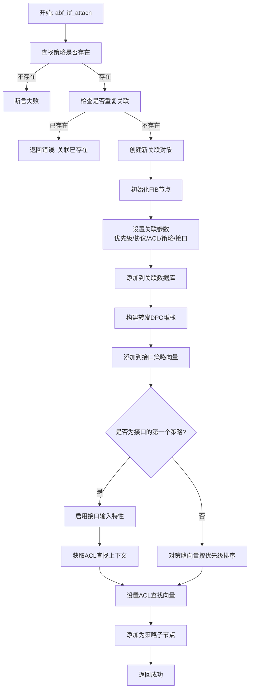
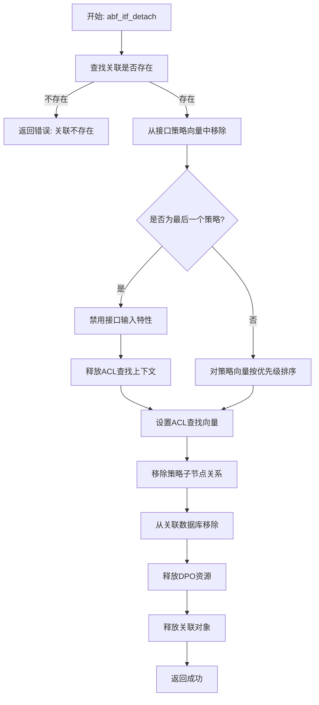
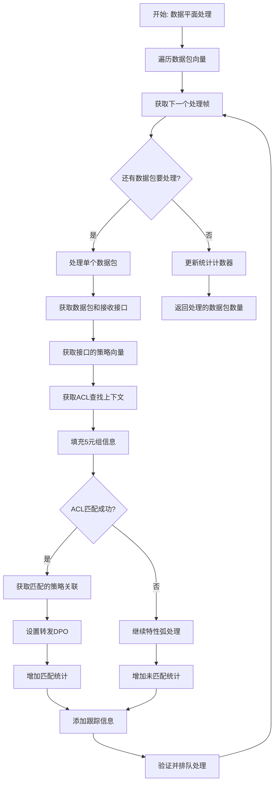
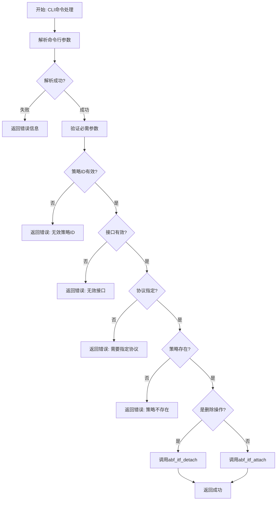
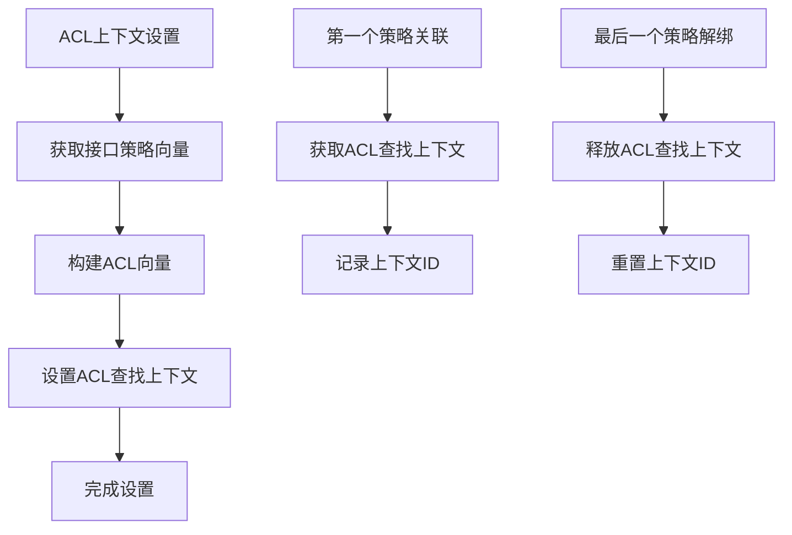

# ABF接口关联模块流程图分析

## 模块概述
`abf_itf_attach.c` 是ABF插件中负责将ABF策略关联到网络接口的模块。主要功能包括策略与接口的绑定、解绑、ACL查找上下文管理以及数据平面转发处理。

## 主要数据结构
- `abf_itf_attach_t`: 接口关联结构体
- `abf_itf_attach_pool`: 关联对象池
- `abf_itf_attach_db`: 关联数据库（策略ID+接口ID → 关联索引）
- `abf_per_itf[]`: 每个接口的策略关联向量
- `abf_alctx_per_itf[]`: 每个接口的ACL查找上下文

## 详细流程图

### 1. 策略关联到接口流程 (abf_itf_attach)

### 2. 策略从接口解绑流程 (abf_itf_detach)

### 3. 数据平面处理流程 (abf_input_inline)

### 4. CLI命令处理流程 (abf_itf_attach_cmd)

### 5. ACL查找上下文管理流程

## 关键函数说明

### 核心管理函数
- `abf_itf_attach()`: 将ABF策略关联到接口
- `abf_itf_detach()`: 从接口解绑ABF策略
- `abf_itf_attach_stack()`: 构建转发DPO堆栈
- `abf_setup_acl_lc()`: 设置ACL查找上下文

### 数据平面函数
- `abf_input_inline()`: 内联数据平面处理函数
- `abf_input_ip4()`: IPv4数据平面处理
- `abf_input_ip6()`: IPv6数据平面处理

### CLI命令函数
- `abf_itf_attach_cmd()`: 处理"abf attach"命令
- `abf_show_attach_cmd()`: 处理"show abf attach"命令

### FIB集成函数
- `abf_itf_attach_back_walk_notify()`: FIB回退遍历通知处理
- `abf_itf_attach_last_lock_gone()`: 最后一个锁释放处理

## 数据流分析

### 关联建立流程
1. **用户输入** → CLI解析 → 策略验证 → 关联创建 → DPO堆栈 → 特性启用 → ACL上下文设置

### 数据平面流程
2. **数据包到达** → 接口识别 → ACL匹配 → 策略选择 → DPO转发 → 下一节点处理

### 解绑流程
3. **用户输入** → CLI解析 → 关联查找 → 向量移除 → 特性禁用 → 资源释放

## 并发安全考虑

- 使用FIB节点锁定机制
- 数据平面处理使用无锁设计
- 接口策略向量操作需要适当的同步
- ACL插件提供线程安全的查找上下文管理

## 性能优化特性

1. **内联处理**: 数据平面使用内联函数减少函数调用开销
2. **向量化处理**: 批量处理数据包提高缓存效率
3. **ACL优化**: 使用ACL插件的内联匹配函数
4. **排序策略**: 按优先级排序策略向量优化匹配顺序

## 错误处理机制

1. **参数验证错误**
   - 无效策略ID
   - 无效接口名称
   - 未指定协议类型
   - 重复关联检测

2. **资源管理错误**
   - 关联不存在
   - 策略不存在
   - ACL上下文分配失败

3. **运行时错误**
   - 数据包处理失败
   - DPO堆栈构建失败

这个流程图清晰地展示了ABF接口关联模块的完整执行逻辑，包括策略关联管理、数据平面处理和ACL集成等关键流程。
