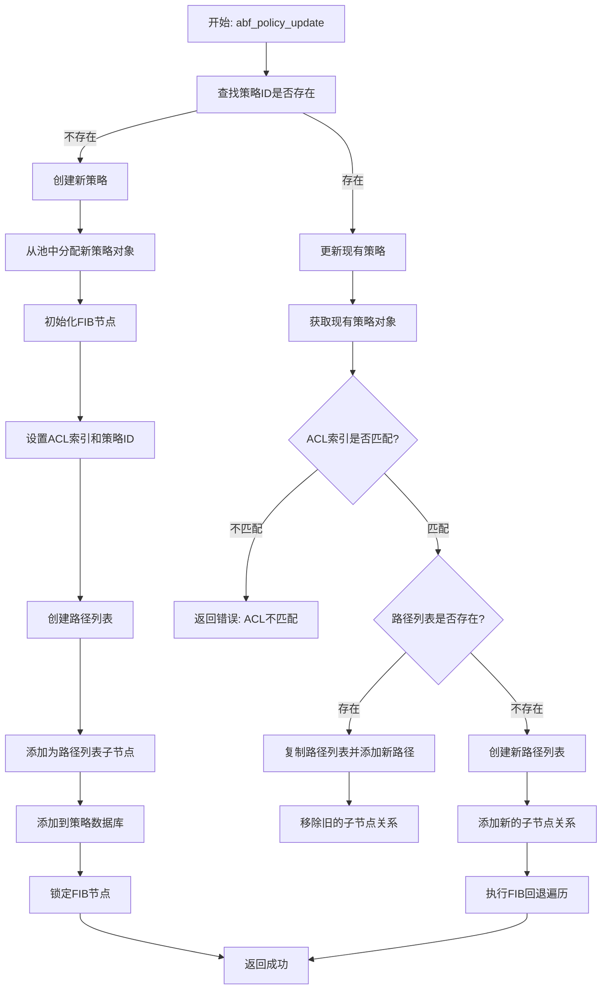
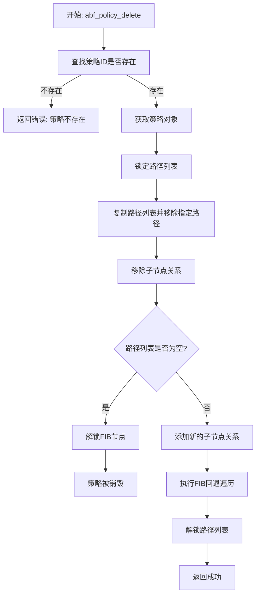
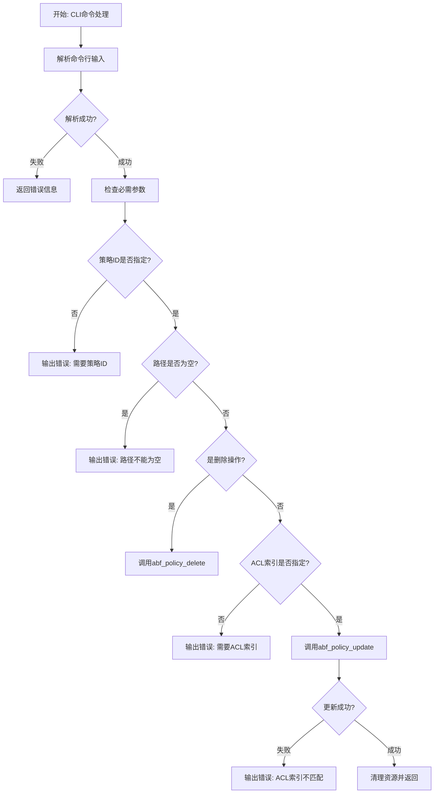
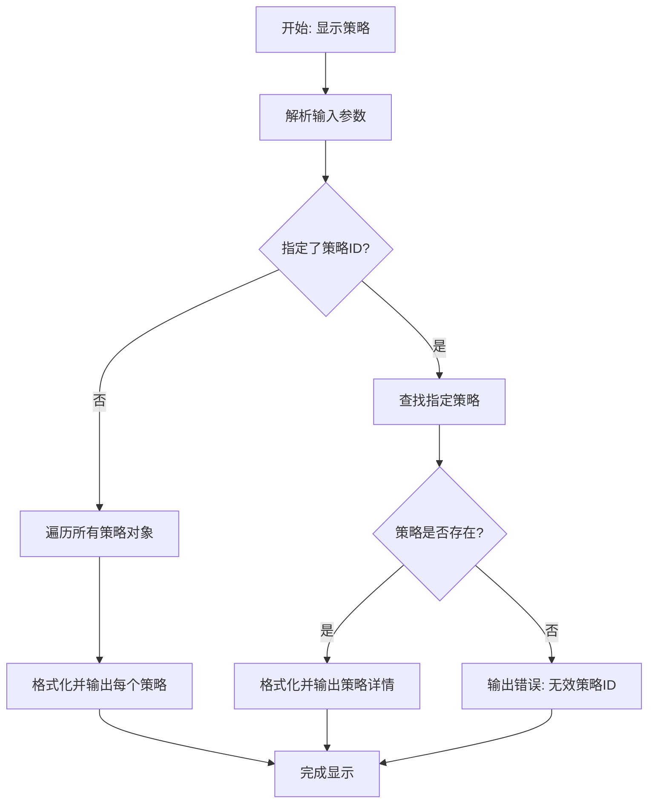
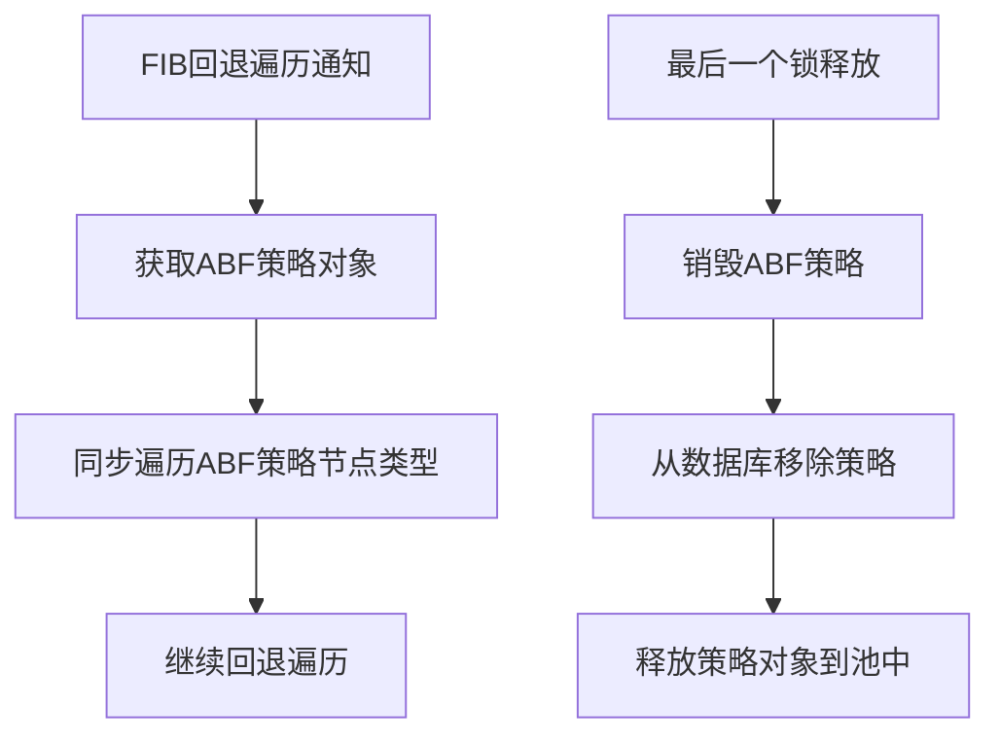

# ABF策略管理模块流程图分析

## 模块概述
ABF (Access-Based Forwarding) 策略管理模块是VPP中的一个插件，负责管理基于访问控制的转发策略。主要功能包括策略的创建、更新、删除、显示以及与FIB（转发信息库）的集成。

## 主要数据结构
- `abf_policy_t`: ABF策略结构体
- `abf_policy_pool`: 策略对象池
- `abf_policy_db`: 策略ID到索引的哈希数据库

## 详细流程图

### 1. 策略创建/更新流程 (abf_policy_update)

### 2. 策略删除流程 (abf_policy_delete)

### 3. CLI命令处理流程 (abf_policy_cmd)

### 4. 策略显示流程 (abf_show_policy_cmd)

### 5. FIB节点集成流程

## 关键函数说明

### 核心管理函数
- `abf_policy_update()`: 创建或更新ABF策略
- `abf_policy_delete()`: 删除ABF策略中的路径
- `abf_policy_find()`: 根据策略ID查找策略索引

### CLI命令函数
- `abf_policy_cmd()`: 处理"abf policy"命令
- `abf_show_policy_cmd()`: 处理"show abf policy"命令

### FIB集成函数
- `abf_policy_back_walk_notify()`: FIB回退遍历通知处理
- `abf_policy_last_lock_gone()`: 最后一个锁释放时的清理
- `abf_policy_get_node()`: 获取FIB节点

## 错误处理机制

1. **参数验证错误**
   - 策略ID未指定
   - 路径列表为空
   - ACL索引未指定
   - ACL索引不匹配

2. **资源管理错误**
   - 策略不存在
   - 内存分配失败

3. **FIB集成错误**
   - 节点锁定/解锁失败
   - 路径列表操作失败

## 数据流分析

1. **策略创建**: 用户输入 → CLI解析 → 策略创建 → FIB集成 → 数据库更新
2. **策略更新**: 用户输入 → CLI解析 → 策略查找 → 路径更新 → FIB同步
3. **策略删除**: 用户输入 → CLI解析 → 策略查找 → 路径移除 → 资源清理
4. **策略显示**: 用户输入 → CLI解析 → 策略查找 → 格式化输出

## 并发安全考虑

- 使用FIB节点锁定机制确保并发安全
- 路径列表操作时进行适当的锁定
- CLI命令标记为多处理器安全(`is_mp_safe = 1`)

这个流程图清晰地展示了ABF策略管理模块的完整执行逻辑，包括策略的生命周期管理、CLI交互和FIB集成等关键流程。
